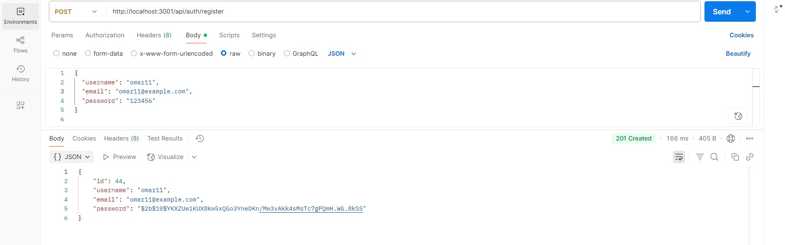
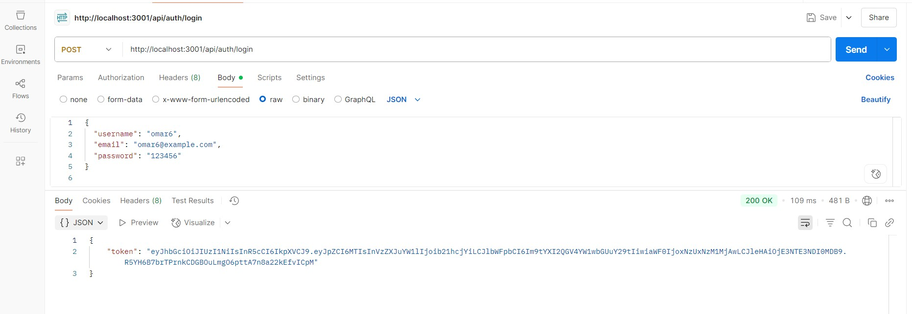
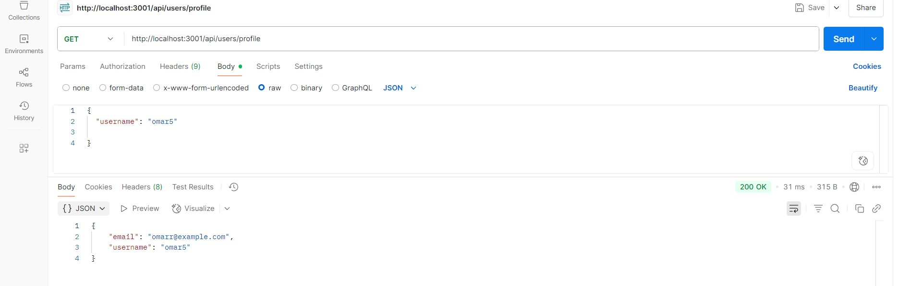
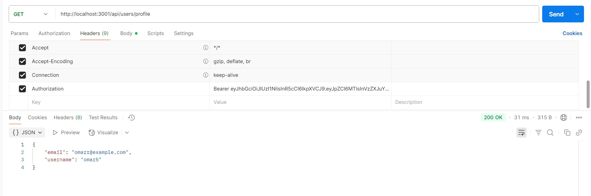
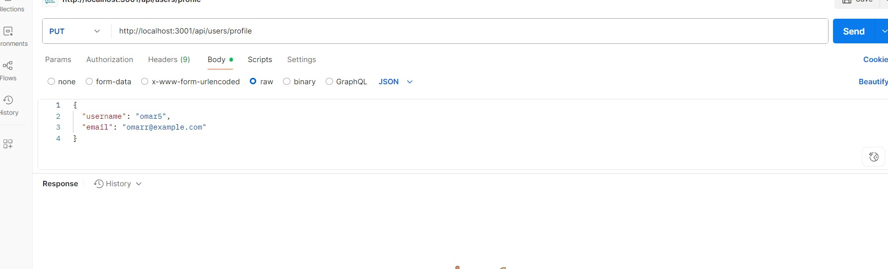
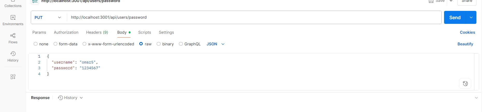
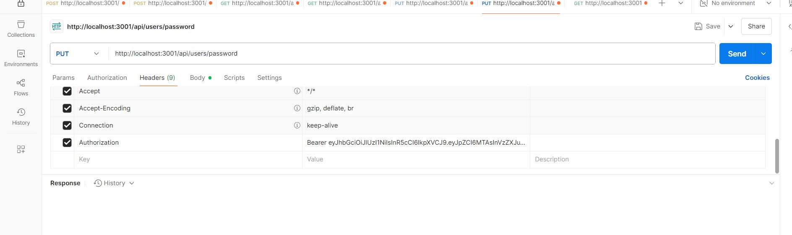

# Flavor-Table-api

### Overview  

>Create a recipe app called Flavor Table that allows users to find recipes based on ingredients using the Spoonacular API. This lab introduces API keys, query parameters, Axios requests, and secure environment variable management.

### Problem Domain  
>Build a nodejs server to fetch real recipe data, search based on user input, and handle API communication securely.The app will use frontend JavaScript (app.js) to fetch data asynchronously from backend API routes and Postgresql data base , providing a smooth user experience.
Modify the previous Flavor Table app to:
>1. Replace IocalStordge with d PostgreSQL database for storing recipes.
>2. Implement CRUD operations to update, delete, and retrieve all recipes.
>3. Update the app in general to interact with the PostgreSQL database.

>Extend the existing Flavor Table app with the following features:
>- Implement user registration and login functionality using email and password.
>- Secure specific routes so that only authenticated users can access them.
>- Deploy the backend server (Nodejs + PostgreSQL) to Render.com.
>- Test all endpoints using Postman.

>What observations or questions do you have about what you've learned so far?
>all clean .

> How long did it take you to complete this assignment? And how long did you expect it to take?
>It took me around half day  to complete this assignment. If I had enough knowledge and experience, it would have taken me less time.
>

## PostMan API

## Registration 
>

## Login 
>

## PRrofile Info  
>
>

## Update User Profile  
>

## Update User password  
>
>

## Web Pages  : 
 Deploy the project to GitHub Pages [Flavor-Table](https://oquraan.github.io/Flavor-Table-api/ "").
